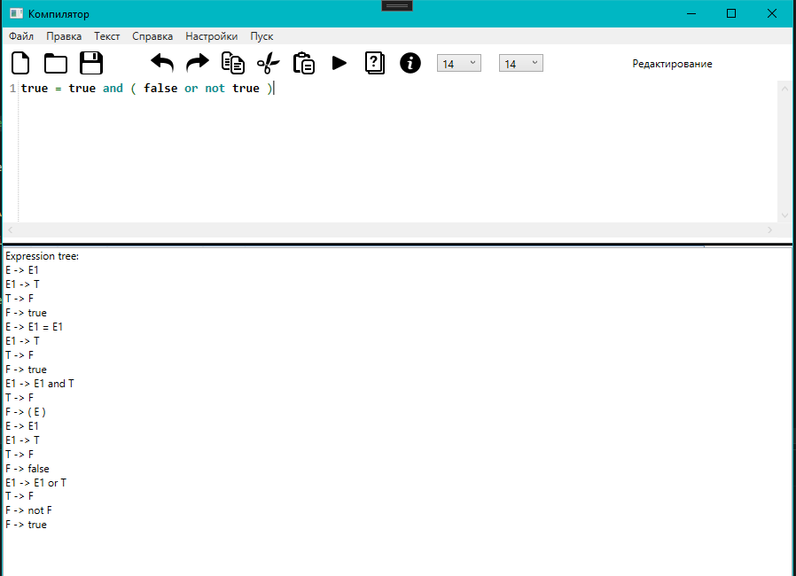
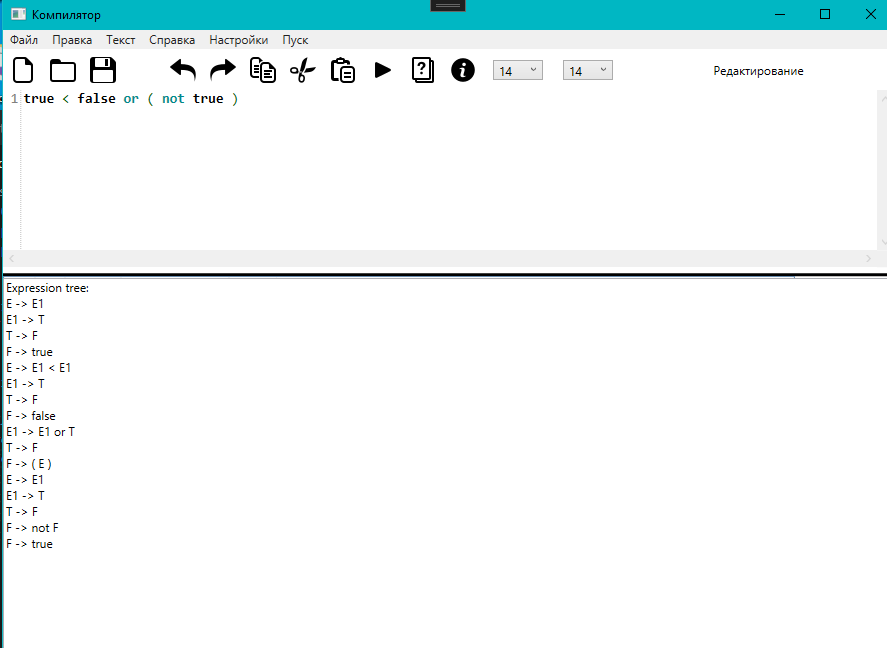

# Лабораторная работа №7
# Вариант 5
## Грамматика
G[E]:
1. E → E1 | E1 [ = | < | > ] E1
2. E1 → T { [ + | - | “or” ] T }
3. T → F { [ * | / | “and” ] F }
4. F → “true” | “false” | “not” F | ( E ) 

## Язык
L(G[E]) = { [(] [not] [(] {true|false}^m>=1 [)] {or|and|+|-|*|/}^n>=0}^k>=1
## Классификация грамматики
Контекстно-свободная
## Тестовые примеры

