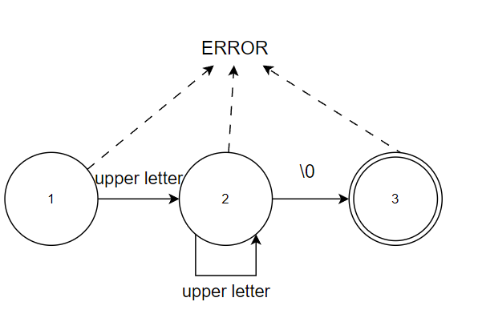
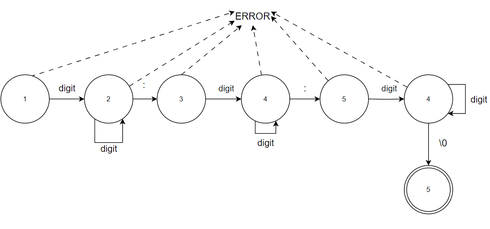
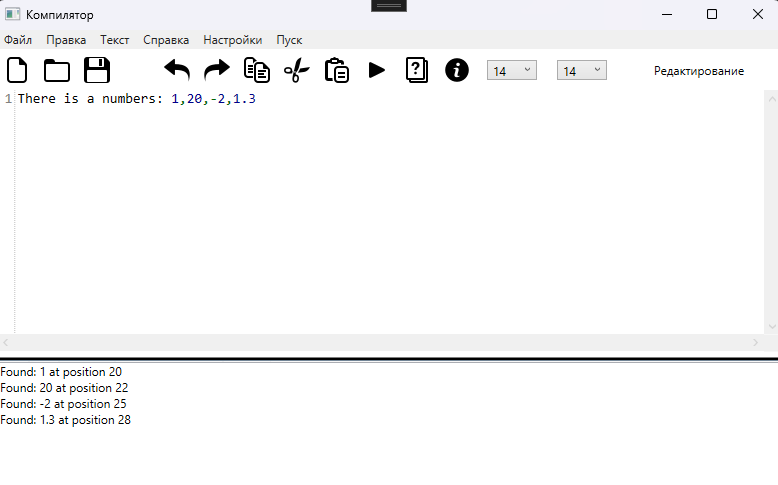
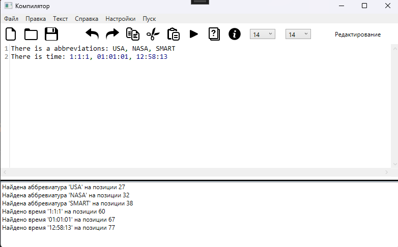

# Лабораторная работа №6
# Реализация алгоритма поиска подстрок с помощью регулярных выражений.

## Цель работы: Реализовать алгоритм поиска в тексте подстрок, соответствующих заданным регулярным выражениям.

## Задание: Используя библиотечные реализации (например, класс Regex в C#), решите 3 задачи в соответствии с персональным вариантом.

1. Построить РВ, описывающее целые числа и числа с
плавающей точкой (разделитель точка).

2. Построить РВ для поиска аббревиатур

3. Построить РВ, описывающее время. Формат: ЧЧ:ММ:СС в
24-часовом формате с необязательным ведущим 0.

## Дополнительное задание: Для задачи из 2 или 3 блока необходимо реализовать алгоритм поиска подстрок в тексте, перейдя к графу автомата.

### Граф автомата для аббревиатур

### Граф автомата для времени, Формат: ЧЧ:ММ:СС в 24-часовом формате с необязательным ведущим 0.

## Тестовые примеры

