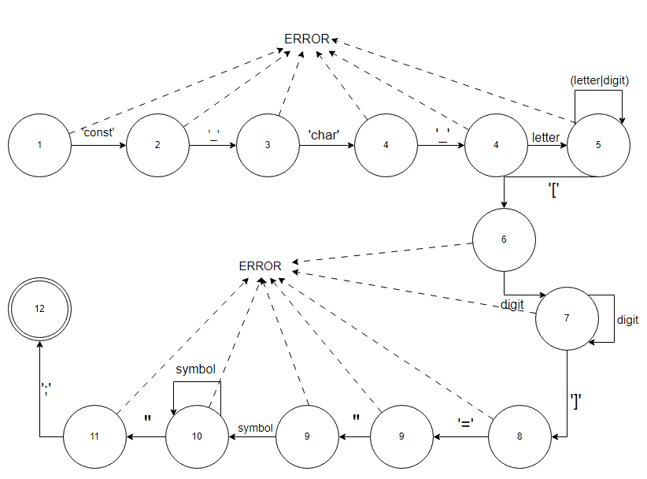

# Синтаксический анализатор для объявление массива символов с инициализацией строковой константой на языке С.

## Цель

Выполнить программную реализацию алгоритма синтаксического анализа для объявление массива символов с инициализацией строковой константой на языке С.

## Вариант задания
**Объявление массива символов с инициализацией строковой константой на языке С**

Пример допустимых строк:
```
const char str[]="Hello world";

const char str[7]="123321"
```

## Разработанная грамматика

1. ‹Def› → 'const' ‹CONST›
1. ‹CONST› → '_' ‹TYPE›
1. ‹TYPE› → 'char' ‹CHAR›
1. ‹CHAR› → '_' ‹ID›
1. ‹ID› → letter ‹IDREM›
1. ‹IDREM› → (letter|digit) ‹IDREM›
1. ‹IDREM› → '['(‹NUMBER›|‹NUMBERREM›)
1. ‹NUMBER› → digit ‹NUMBERREM›
1. ‹NUMBERREM› → digit ‹NUMBERREM›
1. ‹NUMBERREM› → ']' ‹EQUAL›
1. ‹EQUAL› → '='‹COMILLAS›
1. ‹COMILLAS› → " ‹STRING›
1. ‹STRING› → symbol ‹STRINGREM›
1. ‹STRINGREM› → (symbol ‹STRINGREM›|"‹END›)
1. ‹END› → ;
- letter → “a” | “b” | “c” | ... | “z” | “A” | “B” | “C” | ... | “Z”
- digit → “0” | “1” | “2” | “3” | “4” | “5” | “6” | “7” | “8” | “9”
- symbol -> Любой символ из таблицы ASCII кроме двойных и одинарных ковычек

Следуя введенному формальному определению грамматики, представим G[‹Def›] ее составляющими:
- Z = ‹Def›;
- V<sub>T</sub> = {a, b, c, ..., z, A, B, C, ..., Z, _, \n, \t, 1, 2, 3, 4, 5, 6, 7, 8, 9};
- V<sub>N</sub> = {‹Def›, ‹CONST›, ‹TYPE›, ‹CHAR›, ‹ID› , ‹IDREM›, ‹NUMBER› , ‹NUMBERREM› , ‹EQUAL› , ‹COMILLAS› , ‹STRING› , ‹STRINGREM› , ‹END›}.


## Классификация грамматики

Согласно классификации Хомского, грамматика G[‹Def›] является автоматной. 
Правила (1)-(15) относятся к классу праворекурсивных продукций (A → aB | a | ε):

1. ‹Def› → 'const' ‹CONST›
1. ‹CONST› → '_' ‹TYPE›
1. ‹TYPE› → 'char' ‹CHAR›
1. ‹CHAR› → '_' ‹ID›
1. ‹ID› → letter ‹IDREM›
1. ‹IDREM› → (letter|digit) ‹IDREM›
1. ‹IDREM› → '['(‹NUMBER›|‹NUMBERREM›)
1. ‹NUMBER› → digit ‹NUMBERREM›
1. ‹NUMBERREM› → digit ‹NUMBERREM›
1. ‹NUMBERREM› → ']' ‹EQUAL›
1. ‹EQUAL› → '='‹COMILLAS›
1. ‹COMILLAS› → " ‹STRING›
1. ‹STRING› → symbol ‹STRINGREM›
1. ‹STRINGREM› → (symbol ‹STRINGREM›|"‹END›)
1. ‹END› → ;

## Граф конечного автомата

Грамматика G[‹Def›] является автоматной.
Правила (1) – (15) для G[‹Def›] реализованы на графе.
Сплошные стрелки на графе характеризуют синтаксически верный разбор; пунктирные символизируют состояние ошибки (ERROR); и непомеченные дуги предполагают любой терминальный символ, отличный от указанного из соответствующего узла.
Состояние 12 символизирует успешное завершение разбора.

<p align="center"></p>

## Тестовые примеры

1. <p align="center"></p>
1. <p align="center"></p>
1. <p align="center"></p>
1. <p align="center"></p>
1. <p align="center"></p>

## Диаграмма состояний сканера

<p align="center"></p>

## Тестовые примеры

1. <p align="center"></p>
2. <p align="center"></p>

## Пользовательский интерфейс приложения
### Меню текстового редактора

**Пункт "Файл" меню текстового редактора**

В пункте "Файл" меню текстового редактора реализован следующий
функционал:
- Создание документа
- Открытие документа
- Сохранение текущих изменений в документе
- Сохранение документа в новый файл
- Выход из текстового редактора


**Пункт "Правка" меню текстового редактора**

В пункте "Правка" меню текстового редактора реализован следующий
функционал:
- Отмена изменений
- Повтор последнего изменения
- Вырезать текстовый фрагмент
- Копировать текстовый фрагмент
- Вставить текстовый фрагмент
- Удалить текстовый фрагмент
- Выделить все содержимое документа


**Пункт "Текст" меню текстового редактора**

Пункт меню "Текст" содержит следующую информацию 
- Постановка задачи
- Грамматика
- Классификация грамматики
- Метод анализа
- Диагностика и нейтрализация ошибок
- Тестовый пример
- Список литературы
- Исходный код программы


**Пункт "Справка" меню текстового редактора**

Приложение имеет справочную систему, запускаемую командой «Вызов справки».

Справка содержит описание всех реализованных функций меню.


**Пункт "Пуск" меню текстового редактора**

При нажатии на пункт "Пуск" происходит запуск анализатора текста

### Панель инструментов текстового редактора

Панель инструментов содержит кнопки вызова часто используемых пунктов меню:
- Создание документа
- Открытие документа
- Сохранение текущих изменений в документе
- Отмена изменений
- Повтор последнего изменения
- Копировать текстовый фрагмент
- Вырезать текстовый фрагмент
- Вставить текстовый фрагмент
- Запуск синтаксического анализатора
- Вызов справки - руководства пользователя
- Вызов информации о программе
- Закрытие текущей вкладки